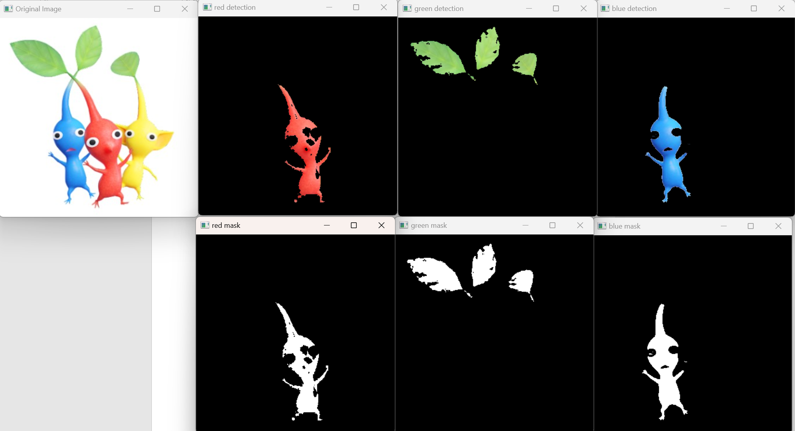

# termproject
## 조원
Group74
 - SEO SIYEON (202335235) : Project: Object Color Classifier with OpenCV (color_detection.py, main.py)
 - Moon JongHan (2023*****)
 - min sungi (202336083)
 - Lee hyunsoo (202336120)
## 오픈소스SW 설명

- SEO SIYEON (202335235)
# Object Color Classifier with OpenCV
### Classifies objects based on their color using OpenCV

This project provides a cool way to classify and detect objects based on their color using just OpenCV and Python.

The project is inspired by color-based object detection techniques and aims to identify and classify objects in an image based on specific color ranges.

## **Key Points**
1. **Steps involved:**
    1. Load the image.
    2. Define color ranges for different objects (e.g., red, green, blue).
    3. Detect the color in the image using OpenCV.
    4. Apply the mask to detect objects of the selected color.
    5. Display the detected objects with bounding boxes or separate the mask and result.
    
2. **Assumptions:**
    1. The object colors are distinguishable in the image based on predefined color ranges.
    2. The object can be detected based on its distinct color.

3. **The process uses color detection techniques:**
    1. Convert the image to HSV color space for easier color detection.
    2. Use OpenCV's `inRange()` function to create a mask for detecting objects within the color range.
    3. Apply the mask to the original image to identify and isolate the objects of interest.

## **Requirements** (with versions I tested on):
1. python (3.7.3)
2. opencv-python (4.1.0)
3. numpy (1.61.4)
4. imutils (0.5.2)

## **Commands to run the detection:**
You can run the `main.py` to process images and detect objects based on their color:

## **Demonstration**

Here is a demonstration of the object detection results:



## Resources
Here are the resources and references used to create this project:

- **OpenCV Documentation**: [https://docs.opencv.org/](https://docs.opencv.org/)
- **OpenCV Tutorials**: [https://docs.opencv.org/master/d9/df8/tutorial_root.html](https://docs.opencv.org/master/d9/df8/tutorial_root.html)
- **Python Official Documentation**: [https://docs.python.org/3/](https://docs.python.org/3/)
- **HSV Color Range Guide**: [https://alloyui.com/color-picker/](https://alloyui.com/color-picker/)


## 오픈소스SW 설명

- Lee Hyunsoo(202336120)

# Arduino-Based Smart Door Lock with OpenCV  
### Secure and control access using a combination of Arduino and OpenCV.

This project combines **OpenCV** and **Arduino** to create a smart door lock system. It uses facial recognition and color-based object detection to securely manage access.  

The project aims to enhance home security by providing a convenient, keyless entry system inspired by cutting-edge computer vision and IoT technologies.  

---

## **Key Points**  

1. **Steps Involved:**  
    1. Capture live video feed using a camera
    2. Detect and recognize faces objects using OpenCV.  
    3. Send control signals to the Arduino for unlocking or locking the door.  

2. **Assumptions:**  
    1. Registered users' faces or authorized color objects are used for authentication.  
    2. The system can distinguish between authorized and unauthorized access based on input.  

3. **The process uses a combination of:**  
    - **Facial Recognition:** OpenCV’s face detection algorithms to verify users.  
    - **Arduino Control:** Signals to actuate a servo motor or solenoid to lock/unlock the door.  

---

## **Requirements** (tested versions):  
1. **Software**:  
    - Python (3.7.3)  
    - opencv-python (4.1.0)  
    - numpy (1.61.4)  
    - imutils (0.5.2)  
    - Arduino IDE  

2. **Hardware**:  
    - Arduino Uno/Mega  
    - Webcam or Raspberry Pi Camera  
    - Servo Motor or Solenoid  
    - Door Lock Mechanism  

---

## **Commands to Run the Project:**  

1. Install the required Python modules:  
    ```bash
    pip install opencv-python numpy imutils
    ```  

2. Run the main script to detect and authenticate users:  
    ```bash
    python door_lock_main.py
    ```  

3. Upload the Arduino code to control the door lock:  
    - Use the Arduino IDE to upload the script to the Arduino board.  


## **Resources**  

- **OpenCV Documentation**: [https://docs.opencv.org/](https://docs.opencv.org/)  
- **Arduino Tutorials**: [https://www.arduino.cc/en/Tutorial/HomePage](https://www.arduino.cc/en/Tutorial/HomePage)  
- **Python Documentation**: [https://docs.python.org/3/](https://docs.python.org/3/)  


